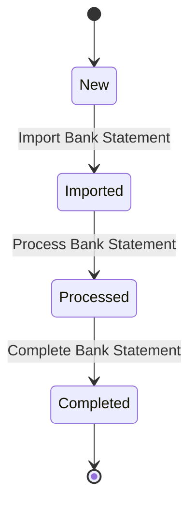
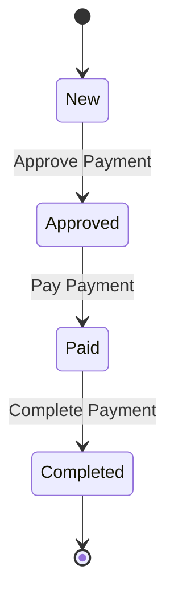
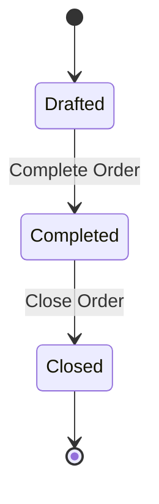

# State Transition Diagrams

This document contains state transition diagrams for various parts of the system. The diagrams are created using mermaid syntax.

## Bank Statement Process

## Payment Process

## Order Process

